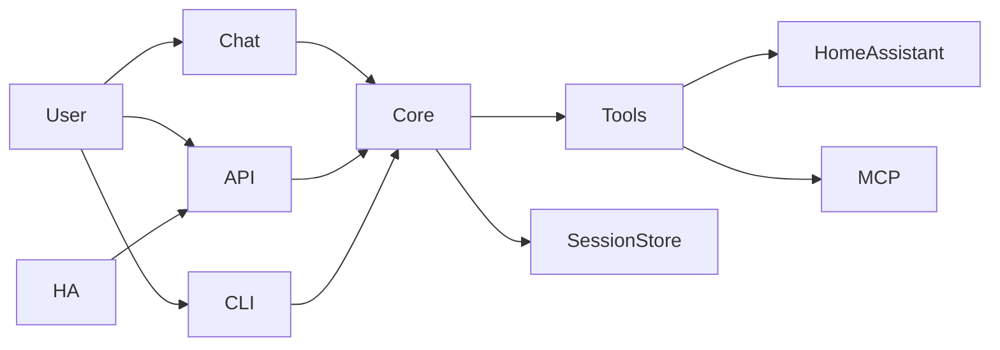

<h1 align="center">Meeseeks: The Personal Assistant 👋</h1>

    
    
    
    
    

> Look at me, I'm Mr Meeseeks.

    

# Project Motivation 🚀
Meeseeks is a personal assistant built on an LLM-driven orchestration loop. It breaks a request into atomic steps, runs tools, and returns a clean summary. The core loop can replan after tool failures and keep short-term state while sessions persist on disk for continuity.

<i>Legends (Expand to View) </i>

| Completed | In-Progress | Planned | Scoping |
| :-------: | :---------: | :-----: | :-----: |
|     ✅    |     🚧     |    📅   |    🧐   |

# Features 🔥
> [!NOTE]
> Visit [**Features - Wiki**](https://github.com/bearlike/Personal-Assistant/wiki/Features) for detailed information on tools and integration capabilities.

<table align="center">
    <tr>
        <th>Answer questions and interpret sensor information</th>
        <th>Control devices and entities</th>
    </tr>
    <tr>
        <td align="center"></td>
        <td align="center"></td>
    </tr>
</table>

- (✅) [LangFuse](https://github.com/langfuse/langfuse) integrations to accurate log and monitor chains.
- (✅) Use natural language to interact with integrations and tools.
- (✅) Simple REST API interface for 3rd party tools to interface with Meeseeks.
- (✅) Handles complex user queries by breaking them into actionable steps, executing these steps, and then summarizing on the results.
- (✅) Custom [Home Assistant Conversation Integration](https://www.home-assistant.io/integrations/conversation/) to allow voice assistance via [**HA Assist**](https://www.home-assistant.io/voice_control/).
- (✅) A chat Interface using `streamlit` that shows the action plan, user types, and response from the LLM.
- (✅) Terminal CLI for interactive sessions with plan + tool result visibility.
- (✅) Plan -> act -> observe loop with re-planning on tool failures.
- (✅) Session transcripts with lightweight compaction for long-running chats.
- (✅) Tool registry with optional MCP tool support via manifest.

## Extras 👽
Optional feature that users can choose to install to further optimize their experience.
- (📅) **`Quality`** Use [CRITIC reflection framework](https://arxiv.org/pdf/2305.11738) to reflect on a response to a task/query using external tools via [`[^]`](https://llamahub.ai/l/agent/llama-index-agent-introspective).
- (🚧) **`Privacy`** Integrate with [microsoft/presidio](https://github.com/microsoft/presidio) for customizable PII de-identification.

## Integrations 📦
- (✅) [Home Assistant](https://github.com/home-assistant/core)
- (🚧) Google Calendar
- (🚧) Google Search, Search recent ArXiv papers and summaries, Yahoo Finance, Yelp
- (🧐) Android Debugging Shell

## Monorepo layout 🧭
- `core/`: orchestration loop, schemas, session storage, compaction, tool registry.
- `tools/`: tool implementations and integrations (including Home Assistant and MCP).
- `meeseeks-api/`: Flask REST API for programmatic access.
- `meeseeks-chat/`: Streamlit UI for interactive chat.
- `meeseeks-cli/`: Terminal CLI frontend for interactive sessions.
- `meeseeks_ha_conversation/`: Home Assistant integration that routes voice to the API.
- `prompts/`: planner prompt and examples.

## Architecture (short) 🧩
Requests flow through a single core engine used by every interface, so behavior stays consistent across UI, API, and voice.

## Installing and Running Meeseeks
> [!IMPORTANT]
> For Docker or manual installation, running, and configuring Meeseeks, visit [**Installation - Wiki**](https://github.com/bearlike/Personal-Assistant/wiki/Installation) or read `docs/README.md` for a quick local/deploy overview.

---

# Contributing 👏

We welcome contributions from the community to help improve Meeseeks. Whether you want to fix a bug, add a new feature, or integrate a new tool, your contributions are highly appreciated.

To contribute to Meeseeks, please follow these steps:

1. Fork the repository and clone it to your local machine.
2. Create a new branch for your contribution.
3. Make your changes, commit your changes and push them to your forked repository.
4. Open a pull request to the main repository, describing your changes and the problem they solve.

## Bug Reports and Feature Requests 🐞

If you encounter any bugs or have ideas for new features, please open an issue on our [issue tracker](https://github.com/bearlike/Personal-Assistant/issues). We appreciate detailed bug reports that include steps to reproduce the issue and any relevant error messages.

Thank you for considering contributing to Meeseeks! Let's build cool stuff!
