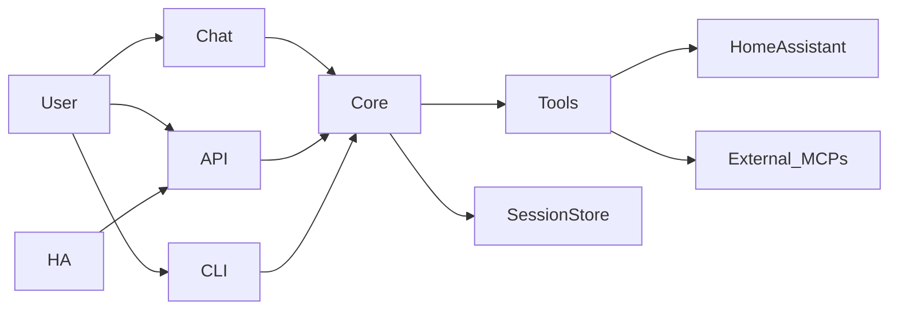

<h1 align="center">Meeseeks: The Personal Assistant 👋</h1>

<p align="center">
    <a href="https://deepwiki.com/bearlike/Personal-Assistant"></a>
    <a href="https://github.com/bearlike/Personal-Assistant/actions/workflows/docker-buildx.yml"></a>
    <a href="https://codecov.io/gh/bearlike/Personal-Assistant"></a>
    <a href="https://codecov.io/gh/bearlike/Personal-Assistant?flags=core"></a>
    <a href="https://github.com/bearlike/Personal-Assistant/actions/workflows/lint.yml"></a>
    <a href="https://github.com/bearlike/Personal-Assistant/actions/workflows/docs.yml"></a>
    <a href="https://github.com/bearlike/Personal-Assistant/releases"></a>
    <a href="https://github.com/bearlike/Personal-Assistant/pkgs/container/meeseeks-chat"></a>
    <a href="https://github.com/bearlike/Personal-Assistant/pkgs/container/meeseeks-api"></a>
</p>


https://github.com/user-attachments/assets/78754e8f-828a-4c54-9e97-29cbeacbc3bc
> Meeseeks runs right in your terminal, browser, or hosted as an API.

# Intro

Meeseeks is an AI assistant running on an Agent orchestration loop. It breaks your requests down into atomic steps, executes the necessary tools, and then synthesizes the results for you. This core loop is smart enough to replan if a tool fails, maintaining short-term state in memory while saving long-term sessions to disk.

<details>
<summary><i>Legends (Expand to View) </i></summary>

| Completed | In-Progress | Planned | Scoping |
| :-------: | :---------: | :-----: | :-----: |
|     ✅    |     🚧     |    📅   |    🧐   |

</details>

# Features

<table align="center">
    <tr>
        <th>Answer questions and interpret sensor information</th>
        <th>Control devices and entities</th>
    </tr>
    <tr>
        <td align="center"></td>
        <td align="center"></td>
        <td align="center"></td>
    </tr>
</table>

- (✅) **Observability:** Includes optional LangFuse integration for tracking; it stays off if unconfigured.
- (✅) **Model Gateway:** Uses LiteLLM for an OpenAI-compatible setup, letting you pick any provider easily.
- (✅) **Natural Interaction:** Just talk naturally to control your integrations and tools.
- (✅) **API Access:** Offers a simple REST API so third-party tools can connect to Meeseeks.
- (✅) **Complex Task Handling:** Breaks big queries into steps, executes them, and summarizes the results for you.
- (✅) **Home Assistant:** Connects with Home Assistant's Conversation Integration for voice control via HA Assist.
- (✅) **Web Chat:** Features a Streamlit interface showing action plans, input types, and LLM responses.
- (✅) **CLI Power:** Runs interactive terminal sessions with full visibility into plans and tool results.
- (✅) **CLI Controls:** See MCP tools clearly and switch models using a wizard right in the terminal.
- (✅) **Smart Execution:** Follows a plan-act-observe loop and automatically replans if a tool fails.
- (✅) **Memory:** Keeps session transcripts and compacts them to handle long chats efficiently.
- (✅) **Tool Management:** Auto-discovers MCP tools in the registry and supports manual manifest overrides.
- (✅) **Safety:** Uses permission gates and hooks to secure tool execution.
- (✅) **Synthesized Replies:** Processes tool outputs first to give you a clean, final answer.

## Extras

Optional feature that users can choose to install to further optimize their experience.

- (📅) **`Quality`** Use [CRITIC reflection framework](https://arxiv.org/pdf/2305.11738) to reflect on a response to a task/query using external tools via [`[^]`](https://llamahub.ai/l/agent/llama-index-agent-introspective).
- (🚧) **`Privacy`** Integrate with [microsoft/presidio](https://github.com/microsoft/presidio) for customizable PII de-identification.

## Monorepo layout

- `packages/meeseeks_core/`: orchestration loop, schemas, session storage, compaction, tool registry.
- `packages/meeseeks_tools/`: tool implementations and integrations (including Home Assistant and MCP).
- `apps/meeseeks_api/`: Flask REST API for programmatic access.
- `apps/meeseeks_chat/`: Streamlit UI for interactive chat.
- `apps/meeseeks_cli/`: Terminal CLI frontend for interactive sessions.
- `meeseeks_ha_conversation/`: Home Assistant integration that routes voice to the API.
- `packages/meeseeks_core/src/meeseeks_core/prompts/`: planner prompts and tool instructions.

## Architecture (short)

Requests flow through a single core engine used by every interface, so behavior stays consistent across UI, API, and voice.



## Documentation

- [docs/index.md](docs/index.md) - product overview and architecture
- [docs/getting-started.md](docs/getting-started.md) - setup guide (env, MCP, configs, run paths)
- [docs/components.md](docs/components.md) - monorepo map
- [docs/reference.md](docs/reference.md) - API reference (mkdocstrings)

## Installation (quick)

User install (core only):
```bash
uv sync
```

Optional components:
```bash
uv sync --extra cli   # CLI
uv sync --extra api   # REST API
uv sync --extra chat  # Streamlit UI
uv sync --extra ha    # Home Assistant integration
```

Developer install (all components + dev/test/docs):
```bash
uv sync --all-extras --all-groups
```

---

# Contributing 👏

We welcome contributions from the community to help improve Meeseeks. Whether you want to fix a bug, add a new feature, or integrate a new tool, your contributions are highly appreciated.

To contribute to Meeseeks, please follow these steps:

1. Fork the repository and clone it to your local machine.
2. Create a new branch for your contribution.
3. Make your changes, commit your changes and push them to your forked repository.
4. Open a pull request to the main repository, describing your changes and the problem they solve.

## Bug Reports and Feature Requests 🐞

If you encounter any bugs or have ideas for new features, please open an issue on our [issue tracker](https://github.com/bearlike/Personal-Assistant/issues). We appreciate detailed bug reports that include steps to reproduce the issue and any relevant error messages.

Thank you for considering contributing to Meeseeks! Let's build cool stuff!
