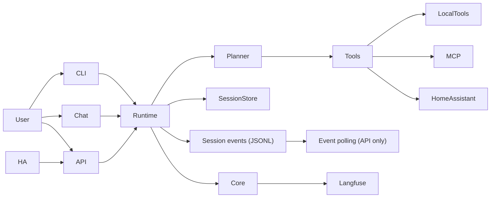

<h1 align="center">Meeseeks: The Personal Assistant 👋</h1>

<p align="center">
    <a href="https://deepwiki.com/bearlike/Assistant"></a>
    <a href="https://github.com/bearlike/Assistant/actions/workflows/docker-buildx.yml"></a>
    <a href="https://github.com/bearlike/Assistant/actions/workflows/lint.yml"></a>
    <a href="https://github.com/bearlike/Assistant/actions/workflows/docs.yml"></a>
    <a href="https://github.com/bearlike/Assistant/releases"></a>
    <a href="https://github.com/bearlike/Assistant/pkgs/container/meeseeks-chat"></a>
    <a href="https://github.com/bearlike/Assistant/pkgs/container/meeseeks-api"></a>
</p>


https://github.com/user-attachments/assets/78754e8f-828a-4c54-9e97-29cbeacbc3bc
> Meeseeks runs right in your terminal, browser, or hosted as an API.

# Intro

Meeseeks is an AI task agent assistant built on a plan-act-observe orchestration loop. It breaks a request into steps, runs tools, and synthesizes a final reply. It keeps a session transcript, compacts long histories, and stores summaries for continuity across longer conversations.

<details>
<summary><i>Legends (Expand to View) </i></summary>

| Completed | In-Progress | Planned | Scoping |
| :-------: | :---------: | :-----: | :-----: |
|     ✅    |     🚧     |    📅   |    🧐   |

</details>

# Feature highlights

<table align="center">
    <tr>
        <th>Answer questions and interpret sensor information</th>
        <th>Control devices and entities</th>
        <th>Web chat interface</th>
    </tr>
    <tr>
        <td align="center"></td>
        <td align="center"></td>
        <td align="center"></td>
    </tr>
</table>

## Core workflow
- (✅) **Plan → act → observe loop:** Builds a short action plan, executes tools, and replans when needed.
- (✅) **Step-level reflection:** Validates tool outcomes and adjusts step arguments when required.
- (✅) **Synthesized replies:** Produces a final answer after tool results are collected and summarized.

## Memory and context management
- (✅) **Session transcripts:** Writes tool activity and responses to disk for continuity.
- (✅) **Context compaction:** Summarizes long sessions and auto-compacts near the context budget.
- (✅) **Token awareness:** Tracks context window usage and exposes budgets in the CLI.
- (✅) **Selective recall:** Builds context from recent turns plus a summary of prior events.
- (✅) **Session listing hygiene:** Filters empty sessions and supports archiving via the API.

## Model and provider support
- (✅) **Model gateway:** Uses LiteLLM for OpenAI-compatible access across multiple providers.
- (✅) **Model routing:** Supports provider-qualified model names and a configurable API base URL.
- (✅) **Reasoning compatibility:** Applies reasoning-effort controls where supported by the model.

## Tooling and integrations
- (✅) **Tool registry:** Discovers local tools and optional MCP tools with manual manifest overrides.
- (✅) **Local file + shell tools:** Built-in Aider adapters for edit blocks, read files, list dirs, and shell commands (approval-gated). Edit blocks require strict SEARCH/REPLACE format; the tool returns format guidance on mismatches.
- (✅) **Home Assistant:** Ships a Conversation integration for voice control and entity actions.
- (✅) **REST API:** Exposes the assistant over HTTP for third-party integration.
- (✅) **Web chat UI:** Streamlit interface with plans, tool input types, and responses.
- (✅) **Terminal CLI:** Fast interactive shell with plan visibility and tool result cards.

## Safety and observability
- (✅) **Permission gate:** Uses approval callbacks and hooks to control tool execution.
- (✅) **Operational visibility:** Optional Langfuse tracing (session-scoped traces) stays off if unconfigured.

## Optional add-ons
Optional features that can be installed when needed.

- (📅) **`Quality`** Use [CRITIC reflection framework](https://arxiv.org/pdf/2305.11738) to reflect on a response to a task/query using external tools via [`[^]`](https://llamahub.ai/l/agent/llama-index-agent-introspective).
- (🚧) **`Privacy`** Integrate with [microsoft/presidio](https://github.com/microsoft/presidio) for customizable PII de-identification.

## Interface notes
- **CLI layout adapts to terminal width.** Headers and tool result cards adjust to small and wide shells.
- **Interactive CLI controls.** Use a model picker, MCP browser, session summary, and token budget commands.
- **Inline approvals.** Rich-based approval prompts render with padded, dotted borders and clear after input.
- **Unified experience.** Web, API, Home Assistant, and CLI interfaces share the same core engine to reduce duplicated maintenance.
- **Shared session runtime.** The API exposes polling endpoints; the CLI runs the same runtime in-process for sync execution, cancellation, and summaries.

## Monorepo layout

- `packages/meeseeks_core/`: orchestration loop, schemas, session storage, compaction, tool registry.
- `packages/meeseeks_tools/`: tool implementations and integrations (including Home Assistant and MCP).
- `apps/meeseeks_api/`: Flask REST API for programmatic access.
- `apps/meeseeks_chat/`: Streamlit UI for interactive chat.
- `apps/meeseeks_cli/`: Terminal CLI frontend for interactive sessions.
- `meeseeks_ha_conversation/`: Home Assistant integration that routes voice to the API.
- `packages/meeseeks_core/src/meeseeks_core/prompts/`: planner prompts and tool instructions.

## Architecture (short)

Requests flow through a single core engine used by every interface, so behavior stays consistent across UI, API, and voice.



## Documentation

The docs landing page mirrors the feature highlights in this README. Keep both updated together for consistent messaging.

**Overview**
- [docs/index.md](docs/index.md) - product overview and architecture

**Setup and configuration**
- [docs/getting-started.md](docs/getting-started.md) - setup guide (env, MCP, configs, run paths)

**Repository map**
- [docs/components.md](docs/components.md) - monorepo map

**Reference**
- [docs/reference.md](docs/reference.md) - API reference (mkdocstrings)
- [docs/session-runtime.md](docs/session-runtime.md) - shared session runtime used by CLI + API

## Installation (quick)

User install (core only):
```bash
uv sync
```

Optional components:
```bash
uv sync --extra cli   # CLI
uv sync --extra api   # REST API
uv sync --extra chat  # Streamlit UI
uv sync --extra ha    # Home Assistant integration
```

Developer install (all components + dev/test/docs):
```bash
uv sync --all-extras --all-groups
```

## Development principles

- Keep the core engine centralized. Interfaces should remain thin to avoid duplicated maintenance.
- Organize logic into clear modules, classes, and functions. Favor readable, well-scoped blocks.
- Prefer small, composable changes that keep behavior consistent across interfaces.

---

# Contributing 👏

We welcome contributions from the community to improve Meeseeks. Use the steps below.

1. Fork the repository and clone it to your local machine.
2. Create a new branch for your contribution.
3. Make your changes, commit them, and push to your fork.
4. Open a pull request describing the change and the problem it solves.

## Bug Reports and Feature Requests 🐞

If you encounter bugs or have ideas for features, open an issue on the [issue tracker](https://github.com/bearlike/Assistant/issues). Include reproduction steps and error messages when possible.

Thank you for contributing.
