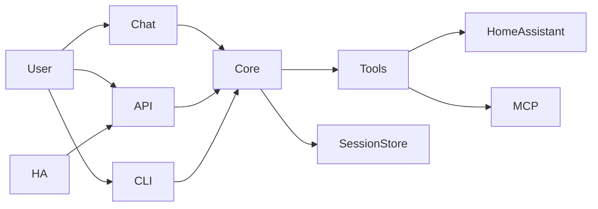

# Meeseeks Docs

Meeseeks is a personal assistant that breaks a request into small actions, runs the right tools, and replies with a clean summary. This doc gives a quick product view and how the parts fit together.

## Features (quick view)
- Plan -> act -> observe loop to keep work grounded in tool results.
- Multiple interfaces (chat UI, REST API, Home Assistant, terminal CLI) backed by one core engine.
- Tool registry for local tools plus optional MCP tools.
- Session transcripts with lightweight compaction for long runs.

## Subprojects and how they fit
- `core/`: orchestration loop, schemas, session storage, compaction, tool registry.
- `tools/`: tool implementations and integrations.
- `meeseeks-api/`: Flask API that exposes the assistant over HTTP.
- `meeseeks-chat/`: Streamlit UI for interactive chat.
- `meeseeks-cli/`: Terminal CLI for interactive sessions.
- `meeseeks_ha_conversation/`: Home Assistant integration that routes voice requests to the API.
- `prompts/`: planner prompt and examples.

## Architecture in a glance
- The UI or API sends a user request into the core orchestrator.
- The orchestrator builds a short action plan, runs tools, and replans if needed.
- Tool results and summaries are stored in a session transcript for continuity.

## Installation (local)
- Prereqs: Python 3.11+, Poetry.
- Install deps: `poetry install`.
- Copy `.env.example` to `.env` and set the required values.
- Run the API: `python meeseeks-api/backend.py`.
- Run the chat UI: `streamlit run meeseeks-chat/chat_master.py`.
- Run the CLI: `python meeseeks-cli/cli_master.py`.

## Deployment (Docker)
- Dockerfiles are provided for the API and chat UI.
- Provide the same environment values as local install.
- Persist data if you want session transcripts (`MESEEKS_SESSION_DIR`).
- Expose the API for Home Assistant or other clients to call.

## Configuration notes
- Tool catalog can be driven by a JSON manifest via `MESEEKS_TOOL_MANIFEST`.
- MCP tools can be enabled with an MCP config via `MESEEKS_MCP_CONFIG`.
