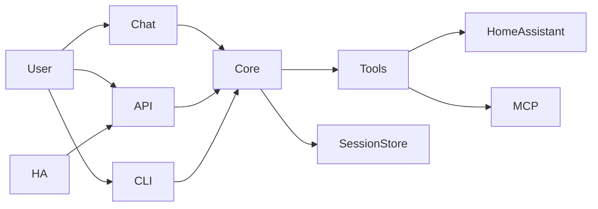

# Meeseeks Docs

Meeseeks is a personal assistant that breaks a request into small actions, runs the right tools, and replies with a clean summary. This doc gives a quick product view and how the parts fit together.

## Features (quick view)
- Plan -> act -> observe loop to keep work grounded in tool results.
- Multiple interfaces (chat UI, REST API, Home Assistant, terminal CLI) backed by one core engine.
- Tool registry for local tools plus optional MCP tools.
- Session transcripts with lightweight compaction for long runs.
- Context-aware memory (recent turns + summary) with optional context selection near budget.
- Step-level reflection after tool execution to validate outcomes.
- Permission gate with approval callbacks plus lightweight hooks around tool execution.
- Optional components (Langfuse, Home Assistant) auto-disable when not configured or when failures occur.

## Subprojects and how they fit
- `core/`: orchestration loop, schemas, session storage, compaction, tool registry.
- `tools/`: tool implementations and integrations.
- `meeseeks-api/`: Flask API that exposes the assistant over HTTP.
- `meeseeks-chat/`: Streamlit UI for interactive chat.
- `meeseeks-cli/`: Terminal CLI for interactive sessions.
- `meeseeks_ha_conversation/`: Home Assistant integration that routes voice requests to the API.
- `prompts/`: planner prompt and examples.

## Architecture in a glance
- The UI or API sends a user request into the core orchestrator.
- The orchestrator builds a short action plan, runs tools, and replans if needed.
- Tool results and summaries are stored in a session transcript for continuity.

## Installation (local)
- Prereqs: Python 3.11+, Poetry.
- Install deps: `poetry install`.
- Copy `.env.example` to `.env` and set the required values.
- Run the API: `python meeseeks-api/backend.py`.
- Run the chat UI: `streamlit run meeseeks-chat/chat_master.py`.
- Run the CLI: `python meeseeks-cli/cli_master.py`.

## CLI quick commands
- `/help` show commands
- `/models` pick a model from your API
- `/mcp` list MCP servers/tools (use `/mcp select` to filter)
- `/mcp init` scaffold an MCP config file
- `/summarize` compact the session
- `/new` start a fresh session
- `/automatic` auto-approve tool actions for the session
- `/quit` exit the CLI

## Deployment (Docker)
- Dockerfiles are provided for the API and chat UI.
- Provide the same environment values as local install.
- Persist data if you want session transcripts (`MESEEKS_SESSION_DIR`).
- Expose the API for Home Assistant or other clients to call.

## Configuration notes
- Tool catalog can be driven by a JSON manifest via `MESEEKS_TOOL_MANIFEST` (optional override; disables auto-discovery).
- MCP tools use:
  - `MESEEKS_MCP_CONFIG`: server connection info (see `configs/mcp.example.json`).
  - A manifest is auto-generated on load (cached under `~/.meeseeks/`) unless you override it.

### Add MCP servers (direct)
1. Copy `configs/mcp.example.json` and set your server URL + headers.
2. Set `MESEEKS_MCP_CONFIG=./configs/your-mcp.json` in `.env`.
3. Start the app once; the tool manifest is auto-discovered and cached.
4. Optional: add `auto_approve_tools` per server to allowlist tools (the CLI writes this if you pick “Yes, always”).

Advanced override:
- If you want a custom tool list, set `MESEEKS_TOOL_MANIFEST` to your own JSON.

Notes:
- If you override the manifest, include `talk_to_user_tool` or you will lose the default reply tool.
- MCP tool names must match the server’s advertised tool list.

### Optional components
- Langfuse observability: set `LANGFUSE_PUBLIC_KEY` + `LANGFUSE_SECRET_KEY` (or disable via `LANGFUSE_ENABLED=0`).
- Home Assistant tools: set `HA_URL` + `HA_TOKEN` (or disable via `MESEEKS_HOME_ASSISTANT_ENABLED=0`).
- Optional components auto-disable on init/runtime/auth errors with logs.
