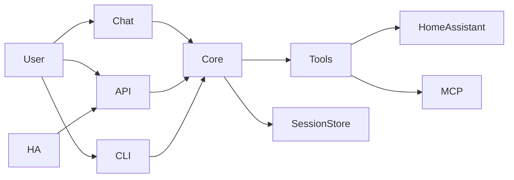

# Meeseeks Docs

Meeseeks is an AI task agent assistant that breaks a request into steps, runs tools, and replies with a synthesized answer. This page serves as a navigation hub and stays aligned with the root README, which is the canonical overview.

## Start here
- [README overview](../README.md)
- [Getting started](getting-started.md)

## Guides
- [Components](components.md) - monorepo map and how parts fit together

## Reference
- [API reference](reference.md) - mkdocstrings reference for core modules

## Architecture in a glance
- The UI or API sends a user request into the core orchestrator.
- The orchestrator builds a short action plan, runs tools, and replans if needed.
- Tool results and summaries are stored in a session transcript for continuity.

## Installation (local)
See [getting-started.md](getting-started.md) for full setup (env, MCP, configs, and how to run each interface).

## CLI quick commands
- `/help` show commands
- `/models` pick a model from your API
- `/mcp` list MCP servers/tools (use `/mcp select` to filter)
- `/mcp init` scaffold an MCP config file
- `/summarize` compact the session
- `/new` start a fresh session
- `/automatic` auto-approve tool actions for the session
- `/quit` exit the CLI

## Deployment (Docker)
See [getting-started.md](getting-started.md) for Docker setup and environment requirements.
