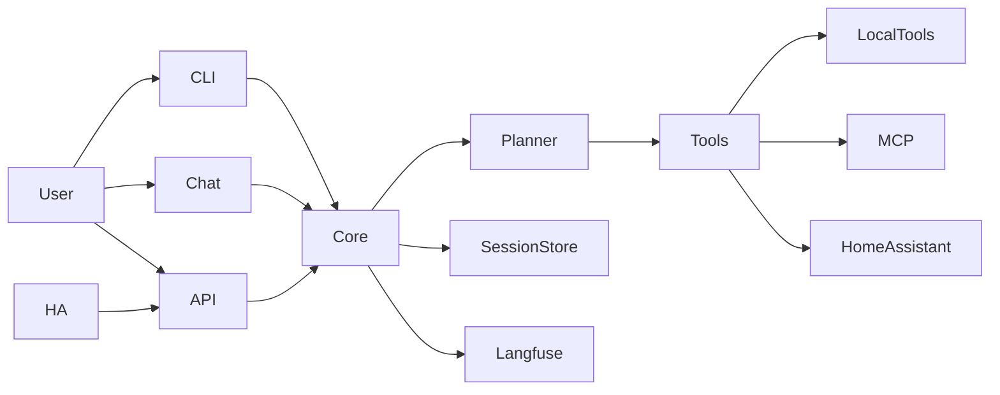

# Meeseeks Docs

Meeseeks is an AI task agent assistant that breaks a request into small actions, runs the right tools, and replies with a clean summary. This landing page mirrors the README feature highlights so the overview stays consistent. Update both when core positioning changes.

## Documentation map

**Overview**
- [README](../README.md) - high-level product overview and feature highlights

**Setup and configuration**
- [Getting started](getting-started.md) - environment setup, MCP config, and run commands

**Repository map**
- [Components](components.md) - monorepo layout and core packages

**Reference**
- [API reference](reference.md) - mkdocstrings reference for core modules

## Feature highlights (quick view)
- Plan → act → observe loop to keep work grounded in tool results.
- Multiple interfaces (chat UI, REST API, Home Assistant, terminal CLI) backed by one core engine.
- Tool registry for local tools plus optional MCP tools.
- Built-in local file and shell tools (Aider adapters) for edit blocks, read, list, and shell execution.
- Session transcripts with compaction for long runs and context budget awareness.
- Context snapshots built from recent turns plus summaries of prior activity.
- Step-level reflection after tool execution to validate outcomes.
- Permission gate with approval callbacks plus lightweight hooks around tool execution.
- Optional components (Langfuse, Home Assistant) auto-disable when not configured.
- Langfuse tracing is session-scoped when enabled, grouping multi-turn runs.

## Repo map (short)
- `packages/meeseeks_core/`: orchestration loop, schemas, session storage, compaction, tool registry.
- `packages/meeseeks_tools/`: tool implementations and integrations.
- `apps/meeseeks_api/`: Flask API that exposes the assistant over HTTP.
- `apps/meeseeks_chat/`: Streamlit UI for interactive chat.
- `apps/meeseeks_cli/`: terminal CLI for interactive sessions.
- `meeseeks_ha_conversation/`: Home Assistant integration that routes voice requests to the API.

Prompts are packaged under `packages/meeseeks_core/src/meeseeks_core/prompts/`.

## Architecture in a glance
- The UI or API sends a user request into the core orchestrator.
- The orchestrator builds a short action plan, runs tools, and replans if needed.
- Tool results and summaries are stored in a session transcript for continuity.

## Getting started
See [getting-started.md](getting-started.md) for full setup (env, MCP, configs, and how to run each interface).

## CLI quick commands
- `/help` show commands
- `/models` pick a model from your API
- `/mcp` list MCP servers/tools (use `/mcp select` to filter)
- `/mcp init` scaffold an MCP config file
- `/summarize` compact the session
- `/new` start a fresh session
- `/automatic` auto-approve tool actions for the session
- `/quit` exit the CLI

## Deployment (Docker)
See [getting-started.md](getting-started.md) for Docker setup and environment requirements.
