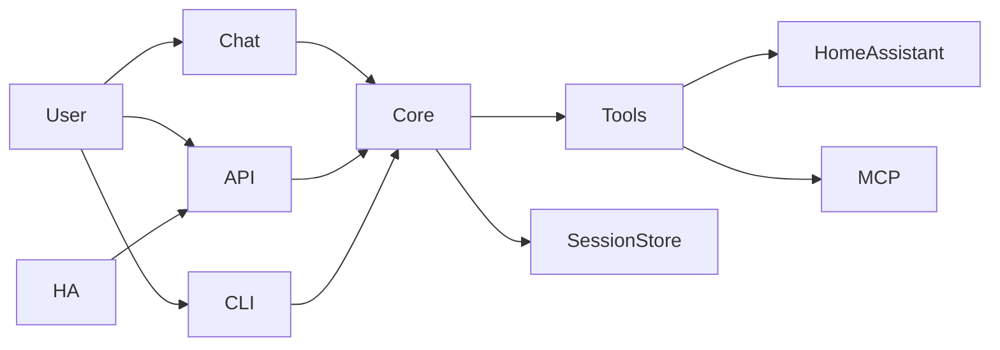

# Meeseeks Docs

Meeseeks is a personal assistant that breaks a request into small actions, runs the right tools, and replies with a clean summary. This doc gives a quick product view and how the parts fit together. Use the links below for setup and deep dives.

- [Getting started](getting-started.md)
- [Components](components.md)
- [API reference](reference.md)

## Features (quick view)
- Plan -> act -> observe loop to keep work grounded in tool results.
- Multiple interfaces (chat UI, REST API, Home Assistant, terminal CLI) backed by one core engine.
- Tool registry for local tools plus optional MCP tools.
- Session transcripts with lightweight compaction for long runs.
- Context-aware memory (recent turns + summary) with optional context selection near budget.
- Step-level reflection after tool execution to validate outcomes.
- Permission gate with approval callbacks plus lightweight hooks around tool execution.
- Optional components (Langfuse, Home Assistant) auto-disable when not configured or when failures occur.

## Subprojects and how they fit
- `core/`: orchestration loop, schemas, session storage, compaction, tool registry.
- `tools/`: tool implementations and integrations.
- `meeseeks-api/`: Flask API that exposes the assistant over HTTP.
- `meeseeks-chat/`: Streamlit UI for interactive chat.
- `meeseeks-cli/`: Terminal CLI for interactive sessions.
- `meeseeks_ha_conversation/`: Home Assistant integration that routes voice requests to the API.
- `prompts/`: planner prompt and examples.

## Architecture in a glance
- The UI or API sends a user request into the core orchestrator.
- The orchestrator builds a short action plan, runs tools, and replans if needed.
- Tool results and summaries are stored in a session transcript for continuity.

## Installation (local)
See [getting-started.md](getting-started.md) for full setup (env, MCP, configs, and how to run each interface).

## CLI quick commands
- `/help` show commands
- `/models` pick a model from your API
- `/mcp` list MCP servers/tools (use `/mcp select` to filter)
- `/mcp init` scaffold an MCP config file
- `/summarize` compact the session
- `/new` start a fresh session
- `/automatic` auto-approve tool actions for the session
- `/quit` exit the CLI

## Deployment (Docker)
See [getting-started.md](getting-started.md) for Docker setup and environment requirements.
