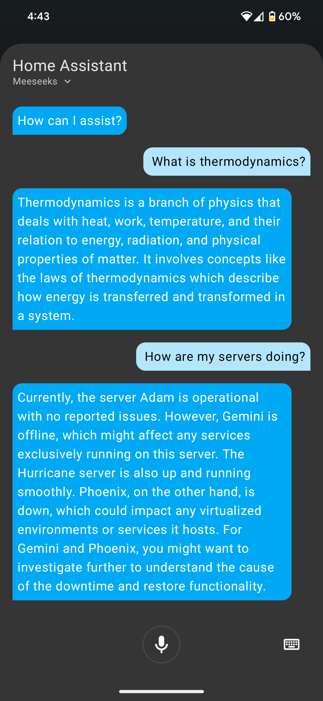

# Home Assistant Voice (HA Assist)

<div style="display: flex; flex-wrap: wrap; gap: 12px; justify-content: center;">
  
  
</div>

The Home Assistant integration lives in `meeseeks_ha_conversation/` and proxies voice requests to the API. It is designed for hands-free voice control: HA handles wake words and intent capture, then forwards the request to the API for orchestration and responses.

## Setup (uv)
```bash
uv sync --extra api --extra ha
```

Before running, complete [Installation](getting-started.md) and [LLM setup](llm-setup.md).

## Install the custom component
1. Ensure the API is running (see [Web + API](clients-web-api.md)).
2. Copy the contents of `meeseeks_ha_conversation/` into Home Assistant under
   `custom_components/meeseeks_conversation/`.
3. In Home Assistant, add the "Meeseeks" conversation integration and set:
   - Base URL: the API base URL (for example, `http://host:5123`).
   - API key: the API master token (`api.master_token` in `configs/app.json`).

## Optional: enable the Home Assistant tool
If bearlike/Assistant should control Home Assistant entities directly:
- Set `home_assistant.enabled` to `true` in `configs/app.json`.
- Provide the Home Assistant URL and token in `home_assistant.*`.
