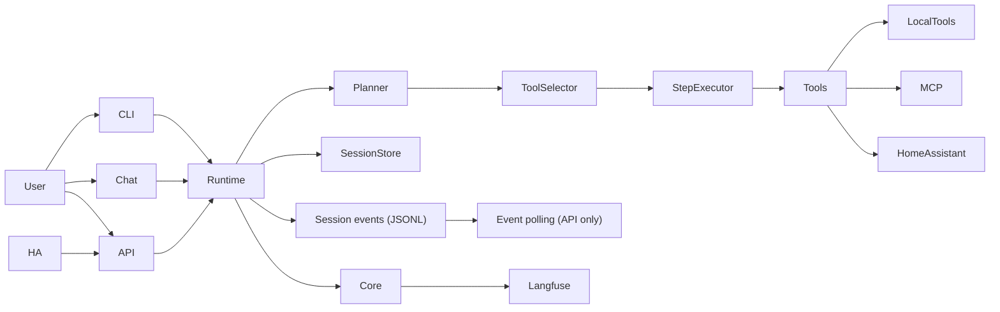

# bearlike/Assistant Docs

bearlike/Assistant (Meeseeks) is an AI task agent assistant that breaks a request into small actions, runs the right tools, and replies with a clean summary. This landing page mirrors the README feature highlights so the overview stays consistent. Update both when core positioning changes.

## Documentation map

**Overview**
- [README](https://github.com/bearlike/Assistant/blob/main/README.md) - high-level product overview and feature highlights
- [Core orchestration](core-orchestration.md) - execution flow and core features

**Setup and configuration**
- [Installation](getting-started.md) - environment setup and install paths
- [LLM setup](llm-setup.md) - minimum LLM config and LiteLLM notes

**Clients**
- [CLI](clients-cli.md) - terminal interface
- [Web + API](clients-web-api.md) - Streamlit chat UI and REST API
- [Home Assistant voice](clients-home-assistant.md) - HA Assist integration

**Developer**
- [Developer guide](developer-guide.md) - core abstractions and new client walkthrough

**Reference**
- [API reference](reference.md) - mkdocstrings reference for core modules
- [Session runtime](session-runtime.md) - shared runtime used by CLI + API

## Feature highlights (quick view)
- Plan → tool selection → step execution loop to keep work grounded in tool results.
- Multiple interfaces (chat UI, REST API, Home Assistant, terminal CLI) backed by one core engine.
- Tool registry for local tools plus optional MCP tools.
- Built-in local file and shell tools (Aider adapters) for edit blocks, read, list, and shell execution.
- Session transcripts with auto-compact for long runs and token budget awareness.
- Context snapshots built from recent turns plus summaries of prior activity.
- Session listings filter empty sessions and support archiving via the API.
- Step-level reflection after tool execution to validate outcomes and adjust tool inputs.
- Permission gate with approval callbacks plus lightweight hooks around tool execution.
- Shared session runtime; API exposes polling endpoints while the CLI runs the runtime in-process for sync execution, cancellation, and summaries.
- Event payloads: `action_plan` steps are `{title, description}`, tool events use `tool_id`, `operation`, and `tool_input`.
- External MCP servers can be added via `configs/mcp.json` with schema-aware tool inputs.
- LiteLLM multi-provider support with per-role model selection (plan, tool, default).
- Optional components (Langfuse, Home Assistant) auto-disable when not configured.
- Langfuse tracing is session-scoped when enabled, grouping multi-turn runs.

## Repo map (short)
- `packages/meeseeks_core/`: orchestration loop, schemas, session storage, compaction, tool registry.
- `packages/meeseeks_tools/`: tool implementations and integrations.
- `apps/meeseeks_api/`: Flask API that exposes the assistant over HTTP.
- `apps/meeseeks_chat/`: Streamlit UI for interactive chat.
- `apps/meeseeks_cli/`: terminal CLI for interactive sessions.
- `meeseeks_ha_conversation/`: Home Assistant integration that routes voice requests to the API.

Prompts are packaged under `packages/meeseeks_core/src/meeseeks_core/prompts/`.

## Architecture in a glance
- The UI or API sends a user request into the core orchestrator.
- The orchestrator builds a short action plan, runs tools, and replans if needed.
- Tool results and summaries are stored in a session transcript for continuity.

## Getting started
See [Installation](getting-started.md) for setup, and [CLI](clients-cli.md) for command reference.

## Deployment (Docker)
See [getting-started.md](getting-started.md) for Docker setup and environment requirements.
