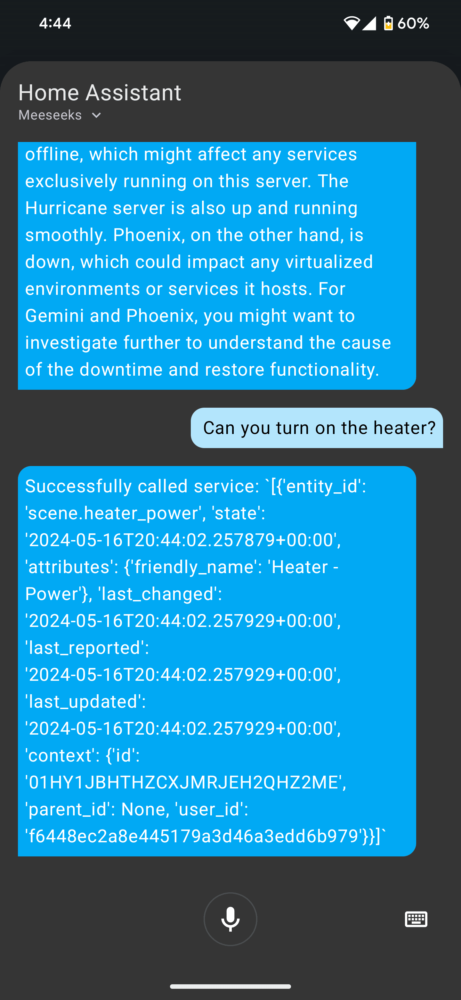

# Home Assistant Conversation Integration for Meeseeks 🚀

<p align="center">
    <a href="https://github.com/bearlike/Assistant/releases"></a>
</p>


<table align="center">
    <tr>
        <th>Answer questions and interpret sensor information</th>
        <th>Control devices and entities</th>
    </tr>
    <tr>
        <td align="center"></td>
        <td align="center"></td>
    </tr>
</table>

- Home Assistant Conversation integration for Meeseeks (works with HA Assist).
- Wrapped around the Meeseeks REST API for synchronous conversations.
- This integration is optional and auto-disables if `home_assistant.enabled` is false or credentials are missing in `configs/app.json`.
- No components are explicitly tested for safety or security. Use with caution in a production environment.
- For full setup and configuration, see `docs/getting-started.md`.

## Install (optional)
```bash
uv sync --extra ha
```

To use it in Home Assistant, install `meeseeks_ha_conversation/` as a custom component
and point it at the Meeseeks API URL + API key.

[Link to GitHub Repository](https://github.com/bearlike/Assistant)
